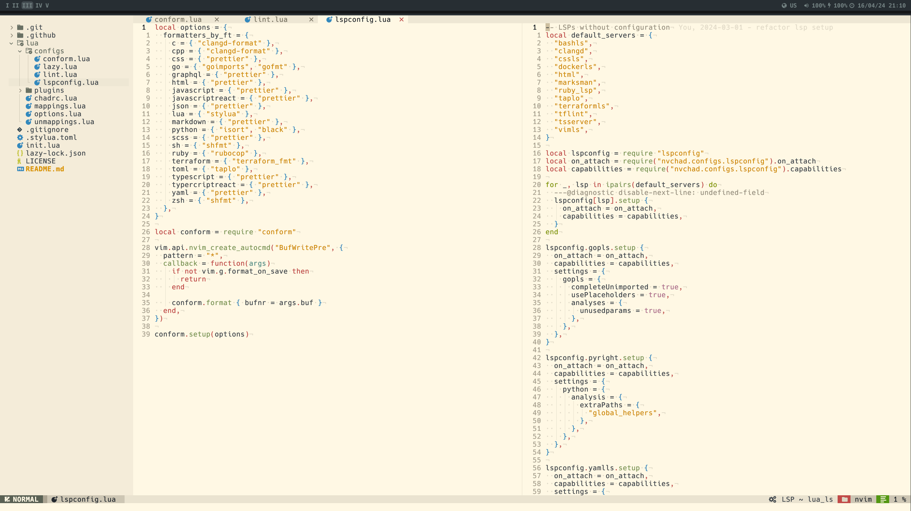
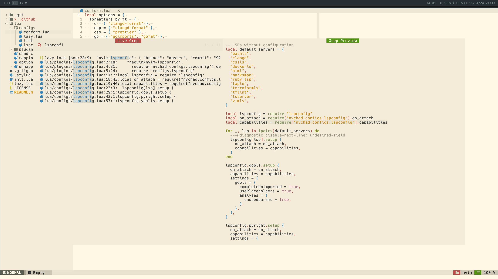
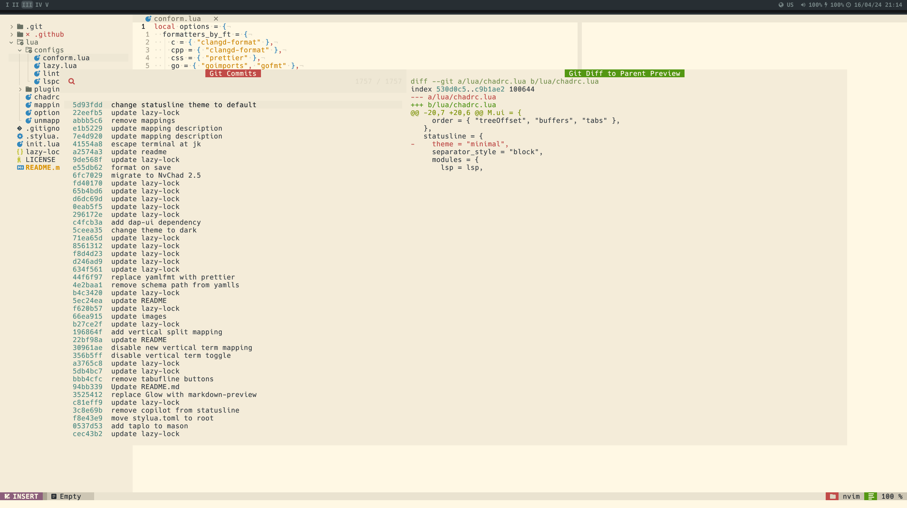
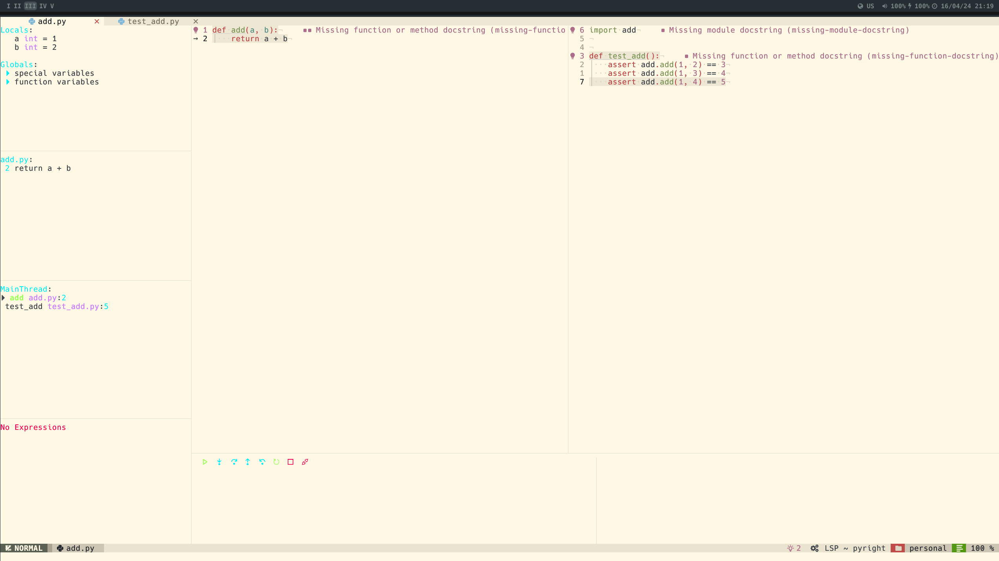
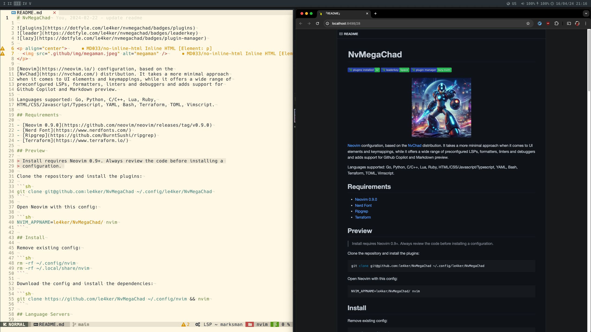
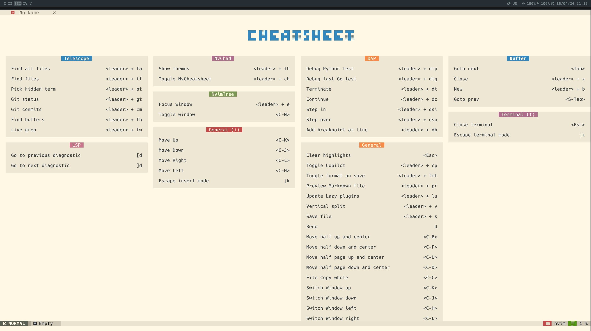

# NvMegaChad


[Neovim](https://neovim.io/) კონფიგურაცია, რომელიც ბაზირებულია
[NvChad](https://nvchad.com/) დისტრიბუციაზე. ეს კონფიგურცია მისიმალისტურია
UI ელემენტების და კლავიშების მალხმობების მიმართ, მაგრამ გვთავაზებს წინასწარ
გაწყობილ LSP-ების, ფორმატერების, ლინტერების და დებაგერების ფართო სპექტრს,
ასევე მუშაობს Github Copilot და Markdown preview, რომელთა ჩართვა და გამორთვა
კლავიატურიდანაა შესაძლებელი.

მე უპირატესობას ვანიჭებ Codeium უფასო სისტემას, მაგრამ ფასიანი
Github Copilot-ის შემთხვევაში, მაინც ვფიქრობ, რომ მისი გამოყნება იქნება
უპრიანი, რადგან ის Github-ის საკუთარი პროდუქტია.

მხარდაჭერილია ენები: Go, Python, C/C++, Lua, Ruby,
HTML/CSS/Javascript/Typescript, YAML, Bash, Terraform, TOML, Vimscript, SQL

## საჭიროებები

- [Neovim 0.9.0](https://github.com/neovim/neovim/releases/tag/v0.9.0)
- [Nerd Font](https://www.nerdfonts.com/)
- [Ripgrep](https://github.com/BurntSushi/ripgrep)
- [Terraform](https://www.terraform.io/)

macOS-ზე უნდა დაინსტალირდეს `make install`-ს გამოყენებით (მე არ გამიტესტია)

## გადახედვა

> ინსტალაცია მოითხოვს Neovim 0.9+. კონფიგურაციის ინსტალაციამდე ეს ყოველთვის
> გადაამოწმეთ.

რეპოზიტორის ქლონირება და პლაგინების ინსტალაცია:

```sh
git clone git@github.com:le4ker/NvMegaChad ~/.config/le4ker/NvMegaChad
make install # works only on macOS
NVIM_APPNAME=le4ker/NvMegaChad/ nvim
```

## ინსტალაცია

ამოიღე არსებული კონფიგი:

```sh
rm -rf ~/.config/nvim
rm -rf ~/.local/share/nvim
```

მე ასევე გირჩევდით:

```sh
rm -rf ~/.cache/nvim
rm -rf ~/.local/state/nvim
```

რეპოზიტორის ჩემს ვარიანტს მოყვება სკრიპტი `remove_nvim_config` და შეგიძლიათ
გამოიყენოთ, ეს დაგიზოგავთ ბევრ დროს, სანამ თქვენ neovim-ის საინსტალაციო
ექსპერიმენტებს დაასრულებთ

დაქლონეთ რეპოზიტორი და დააყენეთ პლაგინები,

```sh
git clone https://github.com/le4ker/NvMegaChad ~/.config/nvim
make install # works only on macOS
nvim
```

ჩემი რეკომენდაციით ინსტალაციის შემდგომ შეასრლეთ

`:MasonInstallAll` და მერე `:Lazy sync`

## მე რა შვევცვალე

1. გავთიშე ავტოკომპლიტის ავტომატური გამოხტომა, გამოდის `Ctrl + Space`-ზე
2. რედაქტორის ვერტიკალური ხაზი დავსვი 80 სიმბოლოზე მხოლოდ MarkDown
   ფაილებისათვის, რადგან ლინტერმა მოითხოვა ასე, მეც დავეთანხმე და გადავაკეთე.
   ზოგადად ვერტიკალური ხაზის მდებარეობა 100 სიმბოლოზე განსაზღვრულია
   `lue/options.lua` ფაილში `colorcolumn = "100"`
3. გავწერე ჩემი კლავიატურის მეპინგი, გარდა Insert რეჟიმისა, ქართულ და
   რუსულ სიმბოლოებს შევუსაბამე ინგლისური სიმბოლოები ეს საშუალებას იძლევა
   vim ბრძანებების შესასრულებლად, ყოველ ჯერზე აღარ გადავრთო კლავიატურა ქართულიდან
   ინგლისურზე, რასაც საკმაო დრო მიაქვს და ტემპსაც აგდებს. ვისაც მრავალენოვან
   ტექსტებზე აქვს სამუშაო, მათ ეს გამოადგებათ, თუმცა აღნიშნული მეპინგი მე
   მორგებული მაქვს ქართულ დვრორაკზე, რაც ქართულ კლავიატურებზე არაა პოპულარული.
   ფაილში ჩახედვით უცბად მიხვდებით, როგორ უნდა მოაწყოთ თქვენი კლავიატურის
   შესაბამისად, ვფიქრობ ნებიმიერმა უნდა გაართვას თავი.
   ეს ფაილი არის `lua/configs/mymappings.lua` ფაილში.

Download the config and install the dependencies:

## Language Servers

- [bash-language-server](https://github.com/bash-lsp/bash-language-server)
- [clangd](https://clangd.llvm.org)
- [css-lsp](https://github.com/microsoft/vscode-css-languageservice)
- [dockerfile-language-server](https://github.com/rcjsuen/dockerfile-language-server-nodejs)
- [gopls](https://pkg.go.dev/golang.org/x/tools/gopls)
- [html-lsp](https://github.com/microsoft/vscode-html-languageservice)
- [lua-language-server](https://github.com/LuaLS/lua-language-server)
- [marksman](https://github.com/artempyanykh/marksman)
- [pyright](https://github.com/microsoft/pyright)
- [ruby-lsp](https://github.com/Shopify/ruby-lsp)
- [taplo](https://taplo.tamasfe.dev/)
- [terraform-ls](https://github.com/hashicorp/terraform-ls)
- [typescript-language-server](https://github.com/typescript-language-server/typescript-language-server)
- [vim-language-server](https://github.com/iamcco/vim-language-server)
- [yaml-language-server](https://github.com/redhat-developer/yaml-language-server)

## Formatters

- [black](https://github.com/psf/black)
- [clang-format](https://www.kernel.org/doc/html/latest/process/clang-format.html)
- [gofmt](https://pkg.go.dev/cmd/gofmt)
- [isort](https://github.com/PyCQA/isort)
- [prettier](https://github.com/prettier/prettier)
- [rubocop](https://github.com/rubocop/rubocop)
- [shfmt](https://github.com/mvdan/sh)
- [sql-formatter](https://github.com/sql-formatter-org/sql-formatter)
- [stylua](https://github.com/JohnnyMorganz/StyLua)
- [terraform_fmt](https://developer.hashicorp.com/terraform/cli/commands/fmt)

## Linters

- [golangci-lint](https://golangci-lint.run/)
- [markdownlint](https://github.com/DavidAnson/markdownlint)
- [pylint](https://pylint.org/)
- [rubocop](https://github.com/rubocop/rubocop)
- [tflint](https://github.com/terraform-linters/tflint)

## Debuggers

- [delve](https://github.com/go-delve/delve)
- [debugpy](https://github.com/microsoft/debugpy)

## Screenshots

### Editor



### Github Copilot


### Search



### Git commits



### Debugger



### Markdown Preview



### Cheatsheet


